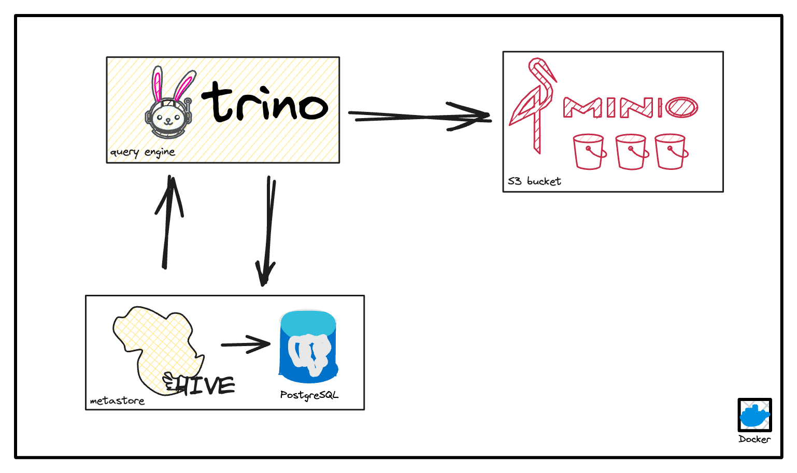

## Description

This repo shows us how to set up minimal datalake-platform (for developing) using **Docker**. It contains these
components:

- **[MinIO](https://github.com/lammn224/docker_datalake_platform/tree/master/minio)**
- **[Hive Metastore](https://github.com/lammn224/docker_datalake_platform/tree/master/hive-metastore)**
- **[Trino](https://github.com/lammn224/docker_datalake_platform/tree/master/trino)**

Please check each component for detail setup!

[1]: http://www.github.com/lammn224

[2]: https://www.linkedin.com/in/lammn

--- 

**Connect with me**

[][1]
[][2]

---